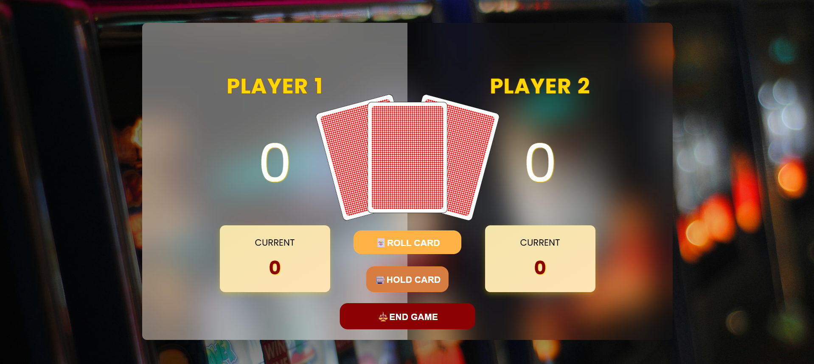

# Joker-is-happy

# 🃏 Joker is Happy - Remi Themed Turn-Based Game

Welcome to **Joker is Happy**, a turn-based browser game inspired by the classic Pig Game — but with a twist! 🎴

In this version, you're not rolling dice — you're drawing **playing cards** from a custom deck. Score as high as possible... unless you draw the **Joker** 😱!

---

## 🎮 Live Demo

👉 [Play Now on Netlify](https://jokerishappy-handyarifin.netlify.app/)

---

## 📸 Preview

 <!-- Ganti dengan screenshot/gif kamu -->

---

## ✨ Features

- 🎴 **Card-based gameplay** replacing dice logic
- 🤡 Joker ends your turn immediately!
- 🧠 Track your current score and high score per player
- 👥 2-Player toggle mode with visual turn cues
- 💥 Countdown & animated end game screen
- 🎰 Casino-inspired UI with vibrant buttons and gradients

---

## 🚀 Tech Stack

- **HTML** – Game layout & structure
- **CSS** – Gradient buttons, blur overlays, custom card animations
- **JavaScript** – Game logic, DOM manipulation, event handling

---
